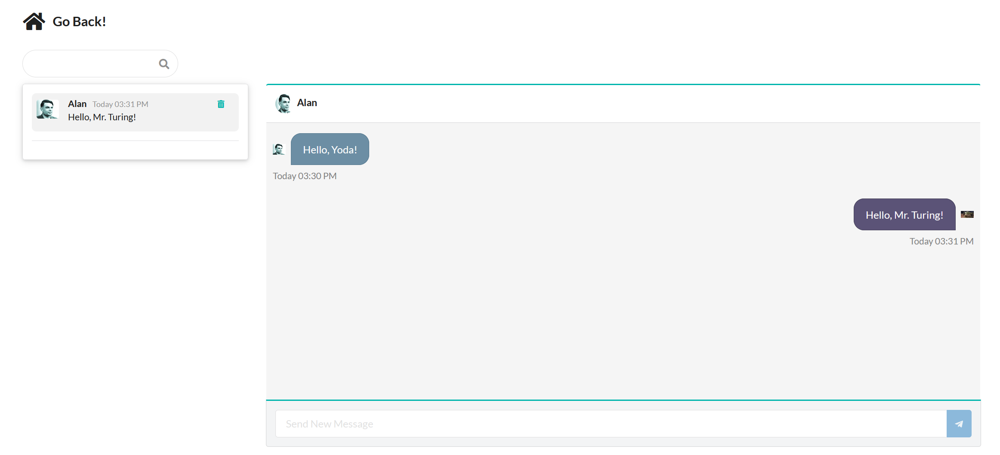

<h1>Blarr</h1>

<h2>Social network for sharing pictures and interacting with other users through post reaction, comments, chatting and following.</h2>

## [Live Demo](https://blarr.onrender.com/)

<h4>   <a href="https://github.com/Roeck/Blarr/blob/master/README.md"> Documentation </a>  ·  <a href="https://github.com/Roeck/Blarr/issues"> Report Bug </a>  ·  <a href="https://github.com/Roeck/Blarr/issues"> Request Feature </a> </h4>

#

 
### :space_invader: Tech Stack :space_invader:

:star: MERN :star:

:zap: JavaScript
:zap: Express.js
:zap: React.js
:zap: Node.js
:zap: MongoDB
:zap: Next.js
:zap: Semantic UI
:zap: JWT :zap:

#

<h3>Features:</h3>

- [x] User Authentication
- [x] Profile editing
- [x] Picture uploading with editing options
- [x] Reaction and comments on pictures
- [x] Real time chatting
- [x] Searching for registered users and following/unfollowing them
- [x] Receiving real time pop up notifications
- [x] Email and password updates

##
 
### :art: Color Reference
| Color | Hex |
| --------------- | ---------------------------------------------------------------- |
| Primary Color |  #036bfc |
| Secondary Color |  #03f4fc |
| Accent Color |  #fc1303 |
| Accent Color2 |  #ffffff |
| Text Color |  #000000 |

##

## :wave: Contributing

Contributions are always welcome!

## :handshake: Contact

Rony Martins - - rons9n@gmail.com

